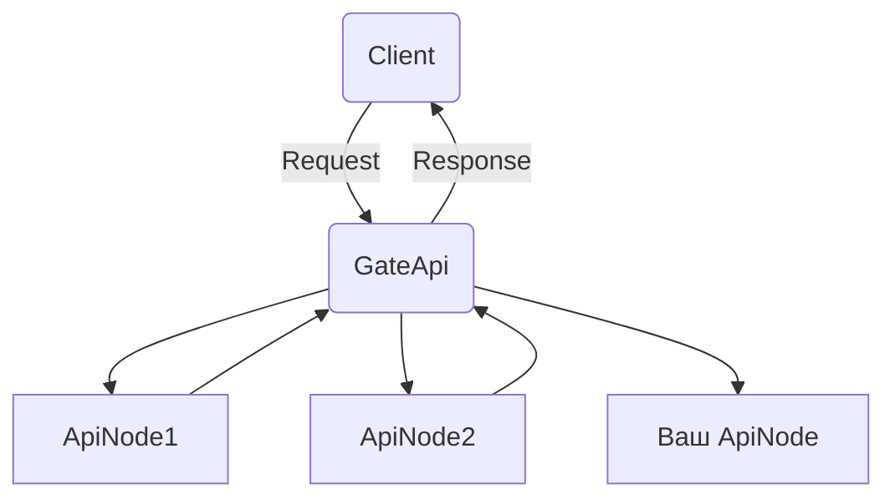

## FSAPP
приложение для быстрого поднятия REST-API приложения с одной точкой входа и вашим функционалом. В целом библиотека дает
возможность не писать код для маршрутизирования, моделей и обработки запросов. Достаточно написать свой класс-обработчик,
при этом соблюдая некторые требования, и ваш REST-API **узел** готов.

Под узлом подразумевается то, что Ваш веб-сервис одна из точек обработки, соединенных с помощью шлюзового API. Схемка 
для наглядности.



### Обобщение

---
Для развертывания вашего собственного web-сервиса с REST API архитектурой:

- Устанавливаем пакет `pip install fsapp`
- Импортируем необходиые объекты
    + `BaseExecutor` - базовый класс для вашего класса(ов)-обработчика(ов)
    + `app` - основной объект приложения FastAPI
    + `handlers` - словарь с добавленными классами обработчиками
    + `settings` - настройки, импортированные из файлов настроек
    + `logger` - объект для логгирования
- Пишем собственный код, главное в итоге получить классы, наследуемые от
`BaseExecutor` с основной асинхронной функцией, которая принимает
список искомых значений и возращает необходимые данные
- Добавляем все обработчики в `handlers`
- Указываем настройки по вашему желанию, главное - оставляем требуемые
- Разворачиваем web-приложение с помощью `uvicorn` или других различных средств (nginx и т.п.)
> **TIPS:** Далее представлены указанные шаги с более подробным описанием


### Установка

---

```bash
$ pip install fsapp
```

### Использование fsapp

Импортируем необходимые объекты для работы приложения

```python
from fsapp import app
from fsapp import BaseExecutor
from fsapp import handlers
from fsapp import settings
from fsapp import logger
```
> **TIPS:** Объект `settings` не является обязательным, использовать только в случае необходимости 
> добавления своих настроек, о настройках ниже

### Настройка

---

На данном этапе уже можно/нужно запустить приложение. Для первого запуска используем [uvicorn](https://www.uvicorn.org/)
```python
import uvicorn

uvicorn.run(app)
```
Веб-сервер будет запущен локально на `http://127.0.0.1:8000`. Как изменить настройки запуска читаем
[здесь](https://fastapi.tiangolo.com/deployment/) и [здесь](https://www.vultr.com/docs/how-to-deploy-fastapi-applications-with-gunicorn-and-nginx-on-ubuntu-20-04/).
Спойлер: первый раз запуск не осуществится.
---
После первой попытки запуска приложения будут созданы два файла с настройками
```plain
. # Путь к корневой папке приложения (где вы устанавливали библиотеку)
├── .secrets.toml   # Файл настроект доступа к веб-приложению по OAuth2 (required)
└── settings.toml   # Основные настройки проекта (required)

*required - обязательные настройки
*optional - необязательные
```
> **TIPS:** Вы можете сами создать их заранее и добавить туда нужные параметры, но лучше так

После этого заполняем необходимые настройки:

Секретные параметры, типа `password` и `token` заносим в файлы настроек в уже преобразованном
`md5` формате, для того чтобы не искать доп. инструменты, можно передать нужное значение функции `hash`
```bash
> py -m fsapp hash 123
202cb962ac59075b964b07152d234b70
```

В созданных файлах `.sercrets.toml` и `settings.toml` уже находятся необходимые настройки для работы
приложения и осущетвления контроля доступом. Подразумевается, что для доступа необходимо лишь одна пара
`имя_пользователя:пароль`. Так что их оставляем в единственном варианте с теми значениями, которые вам нужны.
> **TIPS:** Не забываем, что пароль указывается сразу в преобразованном `md5` значении

Примеры файлов настроек, для `.secrets.toml`

```toml
[auth]
username = "user"
password = "202cb962ac59075b964b07152d234b70"
```

для `settings.toml`

```toml
[required]
instance = "Default_Project"
acces_token_expire_minutes = 1440

[optional]
my_extra_setting = "Example"
```
Чтобы использовать свои собственные настройки для реализации вашего функционала, добавляем необходимые
значения в файл `settings.toml` в секцию `optional`. После этого вы сможете получать доступ к указанным
настройкам через объект `settings`, о чем мы говорили выше

```python
from fsapp import settings

new_parameter = settings.optional.my_extra_setting
```

### Добавляем свой функционал

---

Далее добавляем ваш функционал, для этого необходимо создать класс, который наследуется от `BaseExecutor`:

```python
class BaseExecutor(ABC):
    @abstractmethod
    async def execute_search(self, data_type: str, value: list) -> Tuple[bool, dict]:
        """
        Основная функция, которая вызывается и
        возвращает результат
        :param value: список искомых значений
        :return: возвращаем tuple, где первый элемент - флаг о успешном/неуспешном
        выполнении функции, второй элемент - полученные данные с типом dict, или
        ошибка с типом str
        """
        return True, f"Value: {value}"
```
пример реализации в вашем приложении:
```python
class PhoneSearch(BaseExecutor):

    def __init__(self):
        pass
    async def execute_search(self, data_type: str, value: list) -> Tuple[bool, dict]:
        if data_type == 'phone':
            return True, {"value": "Jhone Dou"}
        elif data_type == 'imsi':
            return True, {"value": "Jhone Dilan"}
        else:
            return False, {"error": "Такой тип данных не обрабатывается"}
``` 

Добавляем в объект `handlers` написанный класс в формате `ключ:значение`, где `ключ` - тип данных,
которые обрабатывает ваш класс, `значение` - разработанный класс

```python
handlers.add_handler('phone', PhoneSearch)
```


и перезапускаем приложение
```python
from fsapp import app
from fsapp import BaseExecutor
from fsapp import handlers
from fsapp import settings

import uvicorn


class PhoneSearch(BaseExecutor):

    def __init__(self):
        pass

    def execute_search(self, type_of_data, value):
        if type_of_data == 'phone':
            return True, {"value": "Jhone Dou"}
        elif type_of_data == 'imsi':
            return True, {"value": "Jhone Dilan"}
        else:
            return False, {"error": "Такой тип данных не обрабатывается"}


handlers.add_handler('phone', PhoneSearch)
handlers.add_handler('imsi', PhoneSearch)
uvicorn.run(app)
```

Для runtime тестирования можно воспользоваться автоматически-созданной `Swagger` документацией, для
этого необходимо перейти по ссылке `[ваш_хост]/docs`. Там же можно ознакомится с импользуемыми моделями
передачи данных, но в целом для вас это прозрачно. По умолчанию для доступа к api стоят настройки 
аутентификации `username:password` -> `user:123`.

### Типы данных

---

Для получения списка строковых значений типов данных, поиск по которым осущестляется в вашем классе,
то есть непоследственно того, что необходимо написать поле `key` при добавлении в `handlers`, нужно
выполнить команду `fields`

```bash
> py -m fsapp fields
Наименования полей, используемых в общем проекте:

+------------+------------------+
| Тип данных |   Обозначение    |
+------------+------------------+
|   phone    | Телефонный номер |
+------------+------------------+

        
Актуальная информация доступна по ссылке: abracodabra.org
```

### Возвращаемые данные

---

Основной и единственный эндпоинт для получения данных - `search`. То, что вы вернули из метода `execute_search` вашего 
класса, будет обёрнуто в модель следующего вида в поле `data`:

```python
from pydantic import BaseModel, Field


class ResponseBody(BaseModel):
    instance: str = Field(title="Instance", description="Сервис, предоставляющий информацию")
    ts: int = Field(title="Timestamp", description="UNIX time выполнения запроса")
    result: bool = Field(title="ResultFlag", description="Результат получен или нет")
    data: dict = Field(title="Data", description="Результат выполнения запроса в общем формате")
```

- instance - имя проекта, взятое из файла настроек 
- ts - время отправки ответа на запрос
- result - булевый флаг, указывающий на успешнойсть выполнения поиска данных
- data - ваши возвращенные данные

> **TIPS**: Протестировать всё можно с помощью `swagger`, для этого необходмо перейти по адресу
> `http://[host]:[port]/docs` там, где развернут ваш сервис.