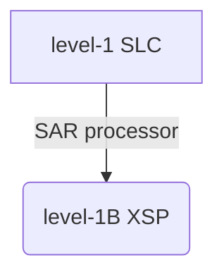

# xsarslc


        
Functions for Sentinel-1 SLC products 

the main feature of this library is the SAR processor:





This is a Work In Progress Library.

Disclaimer: no warranty on the quality of output product at this stage.


# installation
```bash
pip install git+https://github.com/umr-lops/xsar_slc
```

# usage
```python
import xsarslc
```
